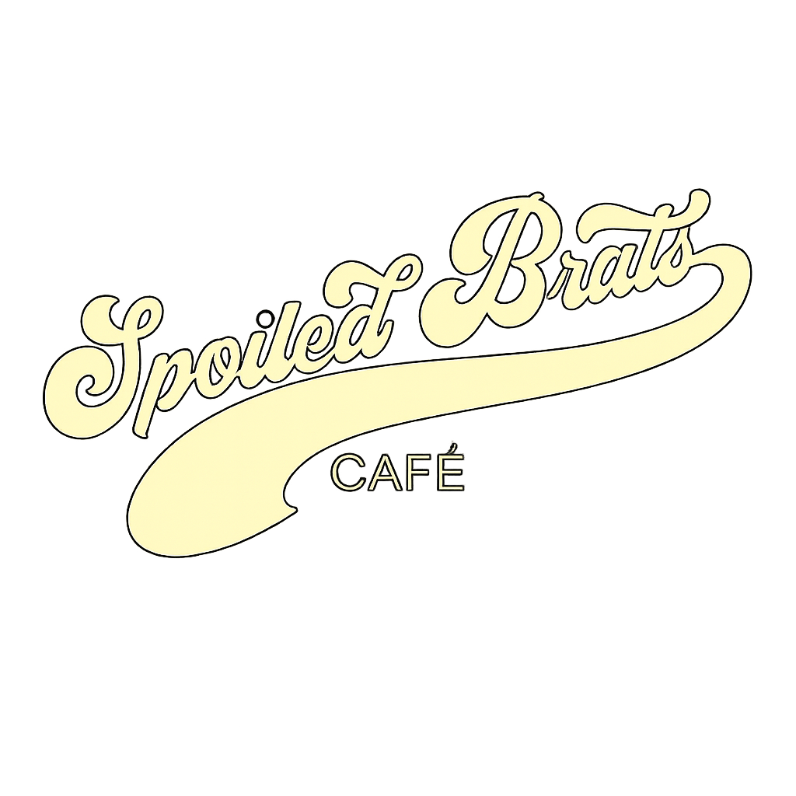
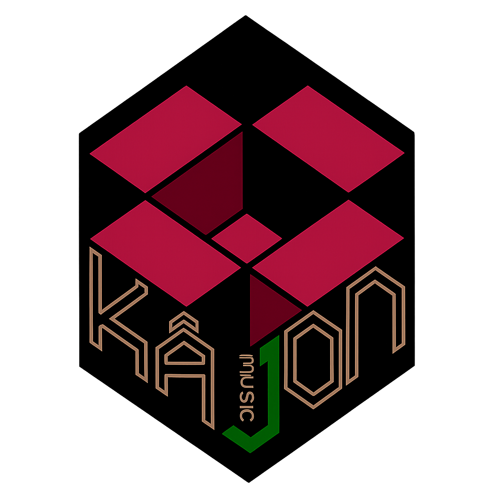

<div align="center">


&nbsp;&nbsp;&nbsp;&nbsp;&nbsp;&nbsp;


# Spoiled Brats HQ

**Full-stack booking platform for Spoiled Brats Cafe & Kajon Music Studio**

*One app. Two spaces. Crafting moments and capturing sound — in Quezon City.*

[](https://react.dev)
[](https://ionicframework.com)
[](https://www.typescriptlang.org)
[](https://supabase.com)
[](https://vitejs.dev)
[](https://www.docker.com)

</div>

---

## Table of Contents

- [About](#about)
- [Features](#features)
  - [Landing Pages](#landing-pages)
  - [Cafe Bookings](#cafe-bookings)
  - [Studio Sessions](#studio-sessions)
  - [Authentication](#authentication)
  - [User Profiles](#user-profiles)
  - [Admin Portal](#admin-portal)
- [Tech Stack](#tech-stack)
- [Project Structure](#project-structure)
- [Getting Started](#getting-started)
- [Environment Variables](#environment-variables)
- [Supabase Setup](#supabase-setup)
  - [Database Tables](#database-tables)
  - [Storage Buckets](#storage-buckets)
  - [Row Level Security](#row-level-security)
  - [Google OAuth](#google-oauth)
  - [Phone OTP](#phone-otp)
- [Deployment](#deployment)
- [Design System](#design-system)
- [Admin Portal Reference](#admin-portal-reference)

---

## About

Spoiled Brats HQ is a production-grade web application that serves as the digital home for two sister venues: **Spoiled Brats Cafe**, a boutique urban retreat for creatives and dreamers, and **Kajon Music Studio**, a professional recording and rehearsal space — both located in Pasong Tamo, Quezon City.

The platform handles everything from public discovery to event booking to admin management in a single Ionic React app backed by Supabase. Guests can explore each venue, check availability, and submit booking requests in minutes. Admins get a full management portal to approve bookings, manage the menu, upload gallery photos, configure store hours, and more — all without touching code.

---

## Features

### Landing Pages

**Combined Home (`/home`)**
- Split-photo hero: cafe and studio side by side, both Ken Burns animated with offset timing
- Each venue presented with service chips, address and phone (tappable), top reviews, and direct booking CTAs
- Hero images are admin-editable via the Photos panel — no code changes needed

**Cafe Overview (`/cafe`)**
- Full-bleed hero with parallax zoom, dynamic background from Supabase
- Gallery grid: one featured image + thumbnail strip
- Find Us info cards (address, phone, email, hours)
- What's Brewing: promo cards with background images
- Google-style review strip with rating badge
- Social links + bottom CTA

**Studio Overview (`/studio`)**
- Same polished layout tailored to the studio brand
- Services grid: first service featured full-width, rest in compact cards
- Studio amenities list loaded from `system_settings`
- Artist review strip

### Cafe Bookings

- Login-gated form with event name, date picker (today+), booking details, and a "Rent Whole Place" toggle that conditionally shows a seat count field
- Availability calendar (FullCalendar month view) — booked dates shown as "Booked" to guests, full event names shown to admins
- My Bookings list with color-coded status badges (Pending / Approved / Rejected / Cancelled)
- Pull-to-refresh, skeleton loading states throughout

### Studio Sessions

- Session type selector: Recording or Rehearsal (pill-style segment)
- Booking form: band/artist name, date, side-by-side start/end time pickers with end > start validation
- Studio availability calendar (FullCalendar week view with month toggle), time grid from 08:00–23:30
- My Sessions list with session type chips and time range display

### Authentication

- **Email/password** sign-up and sign-in
- **Google OAuth** — one-tap continue with Google
- **Phone OTP** with country code dropdown (11 countries, Philippines default):
  - Sign-in: checks if the number is registered before sending OTP; unregistered numbers are redirected to sign-up automatically
  - Sign-up: 3-step flow — personal info → phone number → OTP verification
- Auto-profile creation on first sign-in from any provider
- Session persistence and token auto-refresh

### User Profiles

- Avatar: upload a custom photo (stored in `avatars` bucket), or falls back to styled initials
- Inline edit mode for first/last name, middle initial, and username
- Info card showing email, phone, member-since year
- Quick links to cafe and studio booking history
- Admin badge for admin users

### Admin Portal

Six-tab dashboard accessible only to users with `role = 'admin'`:

| Tab | What it does |
|-----|-------------|
| **Cafe Bookings** | Stats bar, filterable booking list, month calendar, approval modal |
| **Studio Bookings** | Same pattern, time grid calendar, session type chips |
| **Users** | Search users, edit name/username/role |
| **Menu** | Add/edit/delete cafe menu items with image upload |
| **Photos** | Gallery, promos, and hero image management (see below) |
| **Settings** | Store hours editor (Mon–Sun, open/close times for cafe and studio) |

---

## Tech Stack

| Layer | Technology |
|-------|-----------|
| Framework | [Ionic React](https://ionicframework.com) + [React 18](https://react.dev) |
| Language | TypeScript 5 |
| Build tool | Vite 5 |
| Backend | [Supabase](https://supabase.com) (PostgreSQL + Auth + Storage + Realtime) |
| Calendar | [FullCalendar](https://fullcalendar.io) (dayGridPlugin + timeGridPlugin) |
| Icons | [Ionicons](https://ionic.io/ionicons) |
| Routing | React Router DOM (via `@ionic/react-router`) |
| Fonts | Playfair Display, Hanken Grotesk (Google Fonts) |
| Container | Docker (multi-stage) → nginx:stable-alpine |
| Hosting | Google Cloud Run |

---

## Project Structure

```
spoiledbratshq/
├── src/
│   ├── admin/                  # Admin-only components
│   │   ├── AdminCafeBookings.tsx
│   │   ├── AdminStudioBookings.tsx
│   │   ├── AdminGalleryManager.tsx  # Photos tab + hero management
│   │   ├── AdminMenuList.tsx
│   │   ├── AdminScheduleSettings.tsx
│   │   └── AdminUserList.tsx
│   ├── components/
│   │   ├── LoginSignUp.tsx     # Auth form (email + Google + phone OTP)
│   │   ├── ProfileView.tsx     # Profile view + inline edit + avatar upload
│   │   ├── ProtectedRoute.tsx
│   │   └── Skeletons.tsx       # Skeleton loading states
│   ├── context/
│   │   └── AuthContext.tsx     # Session, profile, isAdmin, auth methods
│   ├── hooks/
│   │   └── useToast.tsx        # Reusable toast notifications
│   ├── lib/
│   │   └── supabase.ts         # Typed Supabase client
│   ├── pages/
│   │   ├── HomePage.tsx        # Combined HQ landing page
│   │   ├── CafePage.tsx        # Cafe overview + booking tab
│   │   ├── StudioPage.tsx      # Studio overview + session tab
│   │   ├── CafeBooking.tsx
│   │   ├── StudioBooking.tsx
│   │   ├── AccountPage.tsx
│   │   └── AdminPage.tsx
│   ├── theme/
│   │   └── variables.css       # Acoustic Brew design tokens
│   └── types/
│       └── database.ts         # Full typed Supabase schema
├── static/                     # Public assets (Vite publicDir)
│   ├── cafe-logo-transparent.png
│   ├── studio-logo-transparent.png
│   ├── cafe1.jpg … cafe8.jpg
│   └── studio1.jpg, studio2.jpg
├── supabase/
│   └── migrations/             # SQL migration history
├── Dockerfile                  # Multi-stage: Node build → nginx serve
├── nginx.conf                  # SPA routing, gzip, cache headers
└── .dockerignore
```

---

## Getting Started

### Prerequisites

- Node.js 20+
- A [Supabase](https://supabase.com) project (free tier works)

### 1. Clone and install

```bash
git clone https://github.com/your-username/spoiledbratshq.git
cd spoiledbratshq
npm install
```

### 2. Configure environment

```bash
cp .env.example .env.local
```

Open `.env.local` and fill in your Supabase credentials (found in your project's **Settings → API**):

```env
VITE_SUPABASE_URL=https://your-project-ref.supabase.co
VITE_SUPABASE_ANON_KEY=your-anon-key-here
```

### 3. Run the database migrations

Apply each file in `supabase/migrations/` in order through the **Supabase Dashboard → SQL Editor**, or use the Supabase CLI:

```bash
supabase db push
```

### 4. Start the dev server

```bash
npm run dev
```

The app runs at **http://localhost:3000**.

### 5. Create your first admin

After signing up, set your user's role to `admin` directly in the Supabase Dashboard:

```sql
UPDATE users SET role = 'admin' WHERE email = 'your@email.com';
```

---

## Environment Variables

All `VITE_*` variables are **baked into the JavaScript bundle at build time** by Vite. They are not available at runtime in the container.

| Variable | Required | Description |
|----------|----------|-------------|
| `VITE_SUPABASE_URL` | Yes | Your Supabase project URL |
| `VITE_SUPABASE_ANON_KEY` | Yes | Supabase public anon key |
| `VITE_EMAILJS_SERVICE_ID` | Optional | EmailJS service ID |
| `VITE_EMAILJS_TEMPLATE_ID` | Optional | EmailJS template ID |
| `VITE_EMAILJS_PUBLIC_KEY` | Optional | EmailJS public key |

> The Supabase anon key is a **public** client-side key — it is safe to embed in the bundle. Row Level Security policies control what each user can access.

---

## Supabase Setup

### Database Tables

| Table | Purpose |
|-------|---------|
| `users` | User profiles with `role` (user/admin), linked to Supabase Auth via `auth_id` (UUID) |
| `cafe_schedule` | Cafe event booking requests (pending → approved/rejected/cancelled) |
| `studio_schedule` | Studio session bookings with time range and session type |
| `cafe_menu` | Menu items with price, category, availability, and image URL |
| `cafe_gallery` | Cafe gallery photos with sort order and active flag |
| `studio_gallery` | Studio gallery photos |
| `cafe_reviews` | Cafe guest reviews with rating |
| `studio_reviews` | Studio artist reviews |
| `cafe_promos` | Promotional cards with background image and text |
| `system_settings` | Key/value store for hours, services, hero images, and other config |

### Storage Buckets

| Bucket | Access | Purpose |
|--------|--------|---------|
| `avatars` | Public read, owner write | User profile photos |
| `menu-images` | Public read, admin write | Cafe menu item photos |
| `venue-photos` | Public read, admin write | Gallery, promo, and hero images |

### Row Level Security

RLS is enabled on all tables. Key policies:

- **`users`** — users read/write their own row; admins read/update all rows
- **`cafe_schedule` / `studio_schedule`** — authenticated users insert own bookings; admins manage all
- **`cafe_menu`, gallery tables, review tables, `cafe_promos`** — public read; admins write
- **`system_settings`** — public read; admins write
- **`venue-photos` / `menu-images`** — public read; admins upload/delete
- **`avatars`** — public read; each user manages their own folder (`{user_id}/`)

A `SECURITY DEFINER` function `is_current_user_admin()` is used in policies that check admin status on the `users` table itself, preventing recursive evaluation.

### Google OAuth

1. [Google Cloud Console](https://console.cloud.google.com) → **APIs & Services → Credentials**
2. Create an **OAuth 2.0 Client ID** (Web application)
3. Add authorized redirect URI: `https://<your-project-ref>.supabase.co/auth/v1/callback`
4. **Supabase Dashboard → Authentication → Providers → Google** → paste Client ID and Secret
5. **Supabase Dashboard → Authentication → URL Configuration**:
   - Site URL: `http://localhost:3000` (update to production URL on deploy)
   - Redirect URLs: `http://localhost:3000`, `http://localhost:3000/**`

### Phone OTP

Supabase uses an SMS provider to send OTPs. The app supports **Twilio** (recommended).

**Setup:**

1. Create a [Twilio](https://twilio.com) account and get a phone number
2. Copy your **Account SID**, **Auth Token**, and **phone number**
3. **Supabase Dashboard → Authentication → Providers → Phone**:
   - Enable Phone provider
   - Select **Twilio** as the SMS provider
   - Paste your Twilio credentials

**For local development** — skip real SMS entirely:

- Dashboard → Authentication → Providers → Phone → **Test phone numbers**
- Add e.g. `+639000000000` with a fixed OTP like `123456`
- Use this number in the app without any Twilio charges

**How the phone flow works in this app:**
- Sign-in: the number is checked against the `users` table *before* sending the OTP. Unregistered numbers are redirected to the sign-up flow with the number pre-filled.
- Sign-up: 3-step — personal info → phone + OTP send → verify → account created.

---

## Deployment

The app is containerised with a two-stage Docker build and served via nginx on **Google Cloud Run**.

### Build the image

```bash
docker build \
  --build-arg VITE_SUPABASE_URL=https://your-project-ref.supabase.co \
  --build-arg VITE_SUPABASE_ANON_KEY=your-anon-key \
  -t gcr.io/YOUR_PROJECT/spoiledbratshq .
```

### Push and deploy

```bash
docker push gcr.io/YOUR_PROJECT/spoiledbratshq

gcloud run deploy spoiledbratshq \
  --image gcr.io/YOUR_PROJECT/spoiledbratshq \
  --platform managed \
  --region asia-southeast1 \
  --allow-unauthenticated \
  --port 8080 \
  --memory 256Mi
```

### After first deploy

Copy your Cloud Run service URL and update two places:

1. **Supabase → Authentication → URL Configuration** — set Site URL and add to Redirect URLs
2. **Google Cloud Console → OAuth Client** — add the Cloud Run URL as an authorised JavaScript origin (if not already handled by the Supabase callback)

### nginx highlights

- Listens on port 8080 (Cloud Run default)
- SPA fallback: all unknown paths serve `index.html`
- `index.html` → `no-cache` (always fetch the latest entry point)
- `/assets/*` (Vite hashed bundles) → `immutable, 1 year` (safe; filenames change on rebuild)
- Static images → 30-day cache
- `GET /healthz` → `200 ok` (Cloud Run startup probe)
- Gzip on for JS, CSS, JSON, SVG

---

## Design System

The app uses the **Acoustic Brew** theme — a warm, artisan palette built for a boutique creative space.

### Color Palette

| Token | Value | Role |
|-------|-------|------|
| `--color-primary` | `#ba5624` | Burnt orange — CTAs, icons, active states |
| `--color-secondary` | `#fea451` | Apricot — chips, accents, studio highlights |
| `--color-tertiary` | `#687959` | Sage — rehearsal type, admin badge, amenity dots |
| `--color-background` | `#fff8f8` | Warm cream — app background |
| `--color-on-surface` | `#2d1320` | Espresso — all body text |
| `--color-surface-container-low` | `#fff0f4` | Cream-pink — card tints, input backgrounds |

### Typography

| Role | Font | Weights |
|------|------|---------|
| Headlines | Playfair Display | 400, 600, 700 |
| Body / UI | Hanken Grotesk | 400, 500, 600, 700 |

### Motion

All enter animations use `cubic-bezier(0.22, 1, 0.36, 1)` (ease-out-expo). Page sections stagger at 70–80 ms intervals. Hero backgrounds run a 20-second Ken Burns scale on two offset-timed layers. No layout properties are animated — only `opacity` and `transform`.

---

## Admin Portal Reference

Access the admin portal at `/admin` (visible in the tab bar only when signed in as an admin).

### Photos Tab

The Photos tab gives admins full control over every image in the app — no FTP, no code deployments.

**Cafe Gallery / Studio Gallery:**
- Upload new photos to Supabase Storage (`venue-photos/cafe-gallery/` or `studio-gallery/`)
- Edit alt text and caption for accessibility
- Change sort order with up/down controls
- Toggle visibility without deleting
- Delete a photo (removes from storage and database)

**Promos:**
- Manage the "What's Brewing" promo cards on the cafe overview
- Each card has a background image, title, and optional description

**Hero Images:**
- Replace the full-bleed hero photo on the Cafe page, Studio page, and Home page
- Upload once — all three pages update automatically
- Falls back to bundled static images if no custom URL is set

### Settings Tab

Edit store hours for both the cafe and the studio. Hours are stored in `system_settings` and loaded at runtime, so changes take effect immediately without a redeploy.

---

<div align="center">

Made with care in Quezon City.


&nbsp;&nbsp;


*© 2026 Spoiled Brats & Kajon. Crafting moments, capturing sound.*

</div>
